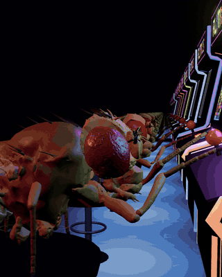
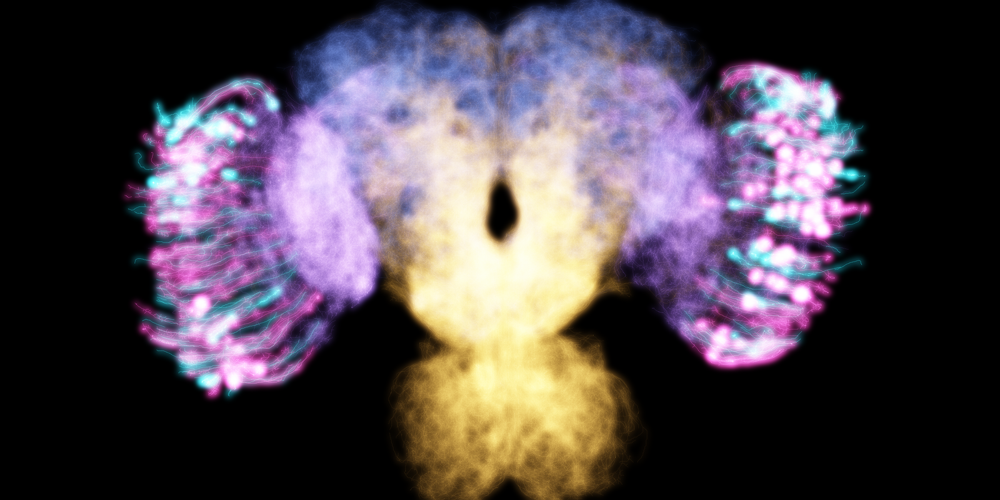
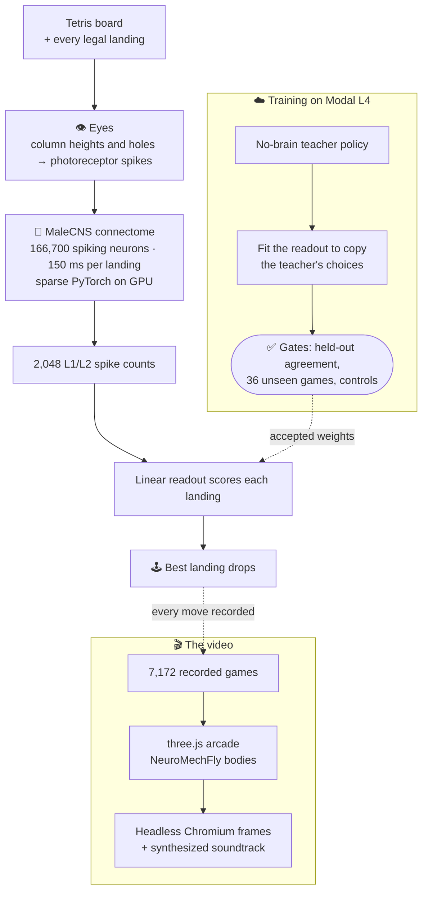

<h1 align="center">Flytris</h1>

<p align="center"><b>A simulated fruit fly brain playing Tetris.</b><br>
The real wiring of an adult fly, all 166,700 neurons, gets the board through its eyes and picks every move.</p>

<p align="center">
  <a href="https://sparkylab.web.app/fly/"></a><br>
  <a href="https://sparkylab.web.app/fly/"><b>▶ Watch with sound</b></a> &nbsp;·&nbsp; <a href="https://sparkylab.web.app/fly/live/"><b>🕹️ Run it live in 3D</b></a>
</p>

<p align="center">
  <a href="https://male-cns.janelia.org/"></a>
  <a href="media/best_game.gif"></a>
  <a href="https://modal.com"></a>
  <a href="https://sparkylab.web.app/fly/live/"></a>
</p>

## How it works



<sub>Real neurons from the connectome Flytris runs. Cyan: photoreceptors, where the board goes in. Pink: L1/L2 neurons, where the move is read out.</sub>

1. 👁️ **Eyes in.** For every place the piece could land, the resulting board's column heights and holes become firing rates on the fly's photoreceptors.
2. 🧠 **Brain runs.** The MaleCNS connectome (166,700 neurons, 124 million synapses, from HHMI Janelia and Google) runs as a spiking network for 150 ms of fly time per landing. The wiring is never trained.
3. 🕹️ **Move out.** A readout over 2,048 L1/L2 neurons scores each landing and the best one drops. Only this readout learns, by copying a simple Tetris strategy.

About 8,000 simulated flies played over the project, an estimated 6 to 8 million runs of the brain. Training ran on [Modal](https://modal.com) L4 GPUs.

## System design



## Results

| | Mean lines | Best |
|---|---:|---:|
| **Fly brain, 36 games it never trained on** | **40.7** | **86** |
| Same brain, neurons silenced | 0.08 | 1 |
| Readout weights shuffled | 5.4 | 8 |
| Eye wiring shuffled | 5.3 | 11 |

The controls ran on 12 of those games, where the intact brain averaged 33.7. Break the neurons or the wiring and it can't play. Full write-up: [docs/V3-FINAL-REPORT.md](docs/V3-FINAL-REPORT.md).

## The video

Every cabinet replays a real recorded game (1,500 of the 7,172 saved move by move). A fly takes off when its game ended, so the order is real, and the last one standing is the 86-line game. The fly is [NeuroMechFly](https://github.com/NeLy-EPFL/flygym), a micro-CT scan of a real *Drosophila*. The music is Korobeiniki, the Tetris tune, synthesized in code. See [arcade3d/](arcade3d/).

## Run it

```bash
pip install numpy pandas pyarrow scipy pillow torch
python -X utf8 data/malecns/build.py   # download and convert the connectome (1.1 GB)
python -X utf8 scripts/render_v3_tournament.py runs/v3_modal/wide2048/replay_seed1800000.npz
```

The last command replays the saved games move by move, checks every line count, and renders them. For the 3D arcade: `cd arcade3d && npm install`, then open `Preview.bat`.

| Folder | What's in it |
|---|---|
| [`flytris/`](flytris/) | Tetris engine, connectome simulator, the fly's eyes |
| [`scripts/`](scripts/) | training, evaluation, Modal jobs, renders |
| [`arcade3d/`](arcade3d/) | the 3D arcade video |
| [`runs/v3_modal/wide2048/`](runs/v3_modal/wide2048/) | the trained readout and the exact replays |
| [`docs/`](docs/) | full report, development history, the original plan |

## Credits

MaleCNS v1.0 connectome by FlyEM (HHMI Janelia), Cambridge, MRC LMB and Google Research, CC BY 4.0 ([Berg et al. 2026](https://doi.org/10.1016/j.cell.2026.08.015)). Neuron model constants from [Shiu et al. 2024](https://github.com/philshiu/Drosophila_brain_model). Fly body from [flygym](https://github.com/NeLy-EPFL/flygym) (Apache-2.0). Compute by [Modal](https://modal.com).
