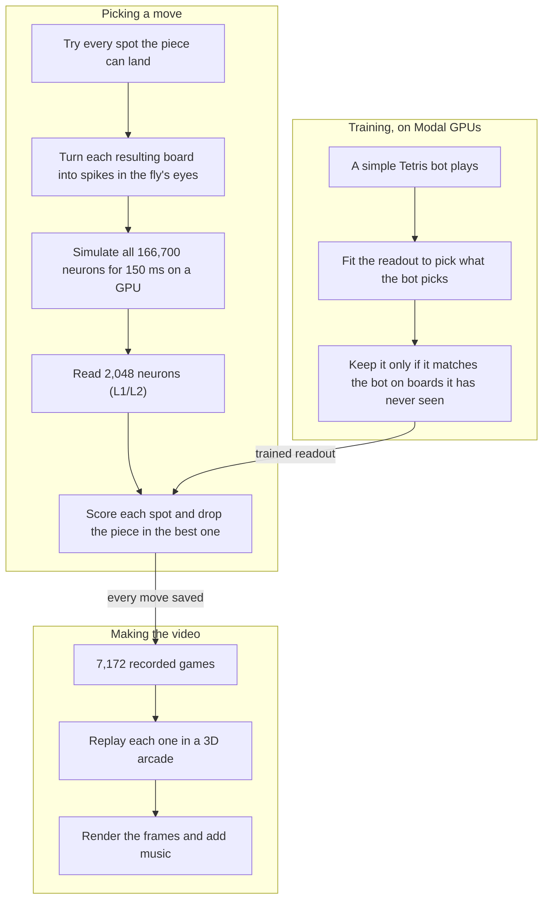

<h1 align="center">Flytris</h1>

<p align="center"><b>A simulated fruit fly brain playing Tetris.</b><br>
The real wiring of an adult fly, all 166,700 neurons, gets the board through its eyes and picks every move.</p>

<p align="center">
  <a href="https://sparkylab.web.app/fly/live/"></a><br>
  <a href="https://sparkylab.web.app/fly/live/"><b>Watch with sound</b></a>
</p>

## How it works


<sub>Real neurons from the connectome Flytris runs. Cyan: photoreceptors, where the board goes in. Pink: L1/L2 neurons, where the move is read out.</sub>

1. **Eyes.** For each spot the piece could land, the board it would leave behind (column heights and holes) becomes spikes in the fly's photoreceptors.
2. **Brain.** The full MaleCNS connectome (166,700 neurons, 124 million synapses, mapped by HHMI Janelia and Google) runs as a spiking network for 150 ms. Its wiring is never changed.
3. **Move.** A readout over 2,048 L1/L2 neurons scores each spot and the piece drops into the best one. This readout is the only part that learns: it was trained to pick the moves a simple Tetris bot picks.

About 8,000 simulated flies played over the project, an estimated 6 to 8 million runs of the brain. Training ran on [Modal](https://modal.com) L4 GPUs.

## System design

Three parts: how the fly picks a move, how its readout was trained, and how the video was made.



## Results

Lines cleared per game. The last three rows each break one part of the fly, and all of them wreck its play, so the skill comes from the brain's activity.

| | Avg lines | Best |
|---|---:|---:|
| **The fly, 36 games it never trained on** | **40.7** | **[86](media/best_game.gif)** |
| Neurons switched off | 0.08 | 1 |
| Readout scrambled | 5.4 | 8 |
| Eye wiring scrambled | 5.3 | 11 |

The last three ran on 12 of those games, where the intact fly averaged 33.7. Full write-up: [docs/V3-FINAL-REPORT.md](docs/V3-FINAL-REPORT.md).

## The video

Every cabinet replays a real recorded game (1,500 of the 7,172 saved move by move). A fly takes off when its game ended, so the order is real, and the last one standing is the 86-line game. The fly is [NeuroMechFly](https://github.com/NeLy-EPFL/flygym), a micro-CT scan of a real *Drosophila*. The music is Korobeiniki, the Tetris tune, synthesized in code. See [arcade3d/](arcade3d/).

## Run it

```bash
pip install numpy pandas pyarrow scipy pillow torch
python -X utf8 data/malecns/build.py   # download and convert the connectome (1.1 GB)
python -X utf8 scripts/render_v3_tournament.py runs/v3_modal/wide2048/replay_seed1800000.npz
```

The last command replays the saved games move by move, checks every line count, and renders them. For the 3D arcade: `cd arcade3d && npm install`, then open `Preview.bat`.

| Folder | What's in it |
|---|---|
| [`flytris/`](flytris/) | Tetris engine, connectome simulator, the fly's eyes |
| [`scripts/`](scripts/) | training, evaluation, Modal jobs, renders |
| [`arcade3d/`](arcade3d/) | the 3D arcade video |
| [`runs/v3_modal/wide2048/`](runs/v3_modal/wide2048/) | the trained readout and the exact replays |
| [`docs/`](docs/) | full report, development history, the original plan |

## Credits

MaleCNS v1.0 connectome by FlyEM (HHMI Janelia), Cambridge, MRC LMB and Google Research, CC BY 4.0 ([Berg et al. 2026](https://doi.org/10.1016/j.cell.2026.08.015)). Neuron model constants from [Shiu et al. 2024](https://github.com/philshiu/Drosophila_brain_model). Fly body from [flygym](https://github.com/NeLy-EPFL/flygym) (Apache-2.0). Compute by [Modal](https://modal.com).
