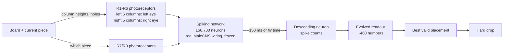
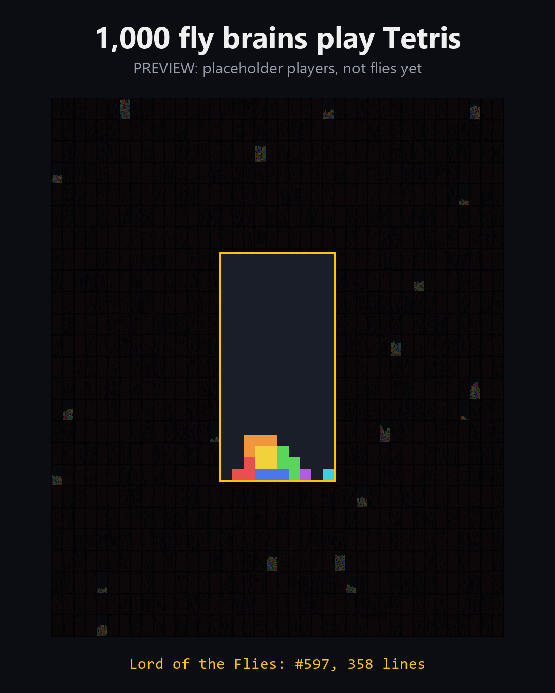

# Flytris

A simulation of a real fruit fly's brain wiring plays Tetris. A thousand flies from the evolution run compete in one final, the winner becomes the Lord of the Flies, and you get to play against it.

> [!NOTE]
> **Status, Sep 13 2026: building.** The Tetris engine, the video renderer, the brain data and the first brain measurements are done. This README is the plan. Results replace it as they come in.

## The idea

In September 2026, HHMI Janelia and Google Research released [MaleCNS v1.0](https://male-cns.janelia.org/download/), the complete wiring diagram of an adult male fruit fly's central nervous system: 166,700 neurons joined by 124 million synapses. Within days people wired it into Doom, Minecraft, Mario 64 and Pong ([list](https://github.com/cobanov/awesome-fly)). I haven't found anyone doing Tetris, or making flies compete.

Flytris runs that wiring as a spiking network on a laptop GPU. It feeds the network the Tetris board through the fly's photoreceptors, reads a decision off the neurons that carry commands from the brain to the body, and evolves a population of flies to find the best player.

## How a fly places one piece



Everything inside the brain box is the real connectome and never changes. The only thing that learns is the readout at the end.

## Plan

### Deliverables

| # | What | Where |
|---|---|---|
| 1 | Hero video: 1,000 flies play the same pieces, boards die one by one, the last one standing is crowned | X, 1080×1350 MP4 |
| 2 | Proof video: best untrained fly vs the champion vs the champion fed the wrong board, same pieces | X reply, this README |
| 3 | Play page: you vs the Lord of the Flies, same pieces, in the browser | GitHub Pages |
| 4 | Results table on unseen games, with controls, including the no-brain number | This README and the post |

What #1 looks like, rendered with stand-in players (a classic Tetris bot at random skill levels, not flies):



### Design decisions

**One decision per piece.** The fly picks a placement (a rotation and a column), then the piece hard-drops. Depending on the piece there are 9 to 34 valid placements. Tetris has a clock, but a simulated brain can't think harder when it's given more time. It runs at a fixed speed, and we decide how much fly time it gets per piece: 150 ms. That suits a fly, which reacts rather than plans. It also costs one brain run per piece instead of one per frame.

**What the fly receives.** The input is not an image. Three things are computed from the board and delivered as firing rates to the photoreceptors: the height of each column, the holes in each column, and which piece is falling.
- **Heights and holes** go to R1-R6: the five left columns to the left eye, the five right columns to the right eye.
- **Positions:** the data has no photoreceptor positions, so each R1-R6 cell takes the optic-lobe column of its strongest lamina partner (L1 or L2). The cells are then sorted into five strips per eye, and in each strip half the cells carry height and half carry holes.
- **The piece** goes to R7/R8, split into seven groups.

**Regular input spikes, not random ones.** The first measurements used random (Poisson) input, and the noise from run to run was almost as large as the difference between two boards. Now the input spikes are evenly spaced, each cell with a fixed random phase. With that change the simulation is deterministic: the same fly on the same pieces always plays the same game, so fitness scores and replays are exact.

**The brain.** A leaky integrate-and-fire network using the neuron constants from [Shiu et al. 2024](https://github.com/philshiu/Drosophila_brain_model), the model that simulated a whole fly brain on a laptop.
- **Timing:** stepped at 1 ms, with the 1.8 ms synaptic delay rounded to 2 steps.
- **Signs:** each synapse takes its sign from the predicted neurotransmitter. Acetylcholine excites; GABA, glutamate and histamine inhibit.
- **Pruning:** connections with fewer than 5 synapses are dropped for speed. That leaves 6.2M of the 25.6M neuron pairs, which still carry 72% of all synapses, and every neuron stays in.
- **Running it:** the network resets to rest before each piece, and all flies share one copy of the wiring on the GPU.

**What learns: only the readout.**
- **Source:** MaleCNS has 1,314 descending neurons, the cells that carry commands from the brain to the body. Their spike counts are pooled by cell type and side into 953 groups.
- **Picking the inputs:** the readout uses the 32 groups that carry the most board information. They're chosen once, before training, on practice boards from piece sequences that are never used for training or evaluation.
- **The layer:** it scores the 10 columns and 4 rotations, about 460 numbers in all, and it's the only thing trained.
- **Choosing a move:** each valid placement for the current piece scores its rotation's score plus the average score of the columns it covers. The best valid placement wins, and invalid ones are never considered.

Why not learn inside the brain? Two projects tried dopamine-style plasticity, and their own READMEs report it didn't produce reliable learning ([DOOMFLY](https://github.com/nftechie/doomfly), [FlyPong](https://github.com/jonatasperaza/FlyPong)). [Fly Dino](https://github.com/cobanov/flyjump) froze a fly circuit and evolved only the readout: it finished 99 of 100 courses, and 0 of 100 with the circuit silenced. Flytris follows that recipe with the whole brain.

**Not the famous steering neurons.** The obvious story would be "the fly steers the piece with its turning neurons," DNa01 and DNa02. In the first measurements those fire at most once per 150 ms. The left/right information shows up across the broad descending population instead, so the readout uses that, and we won't make the steering claim.

### Measured so far (phase 1, real wiring)

64 flies at once on an RTX 3050 Ti Laptop GPU, 150 ms per piece, random input (before the switch to regular spikes):

| | 10+ synapses | **5+ synapses** |
|---|---|---|
| Connections kept / share of all synapses | 2.75M / 54% | **6.24M / 72%** |
| Fly-seconds simulated per real second | 5.73 | **4.07** |
| Peak GPU memory | 0.29 GB | **0.33 GB** |
| Descending neurons firing with no input | 0 | **0** |
| Descending neurons firing with a board | 511 | **597** |
| Share of all neurons spiking per ms (runaway check) | 0.95% | **0.94%** |
| Descending neurons preferring one eye (\|z\| > 3) | 304 | **315** |

The board signal gets through, nothing runs away, and left and right are distinguishable. The weak spot was run-to-run noise, which the switch to regular input addresses.

### Phase 1b: before any training code (about 30 minutes)

1. **Determinism.** With regular input, the same board gives identical counts, and one fly gives the same counts whether it runs alone or in a batch of 64.
2. **Decode gate.** Collect 600 practice boards from real games. Fit a linear decoder from the 32 groups on 500 boards and test it on the other 100.
   - It must predict each column's height **relative to the board's average height** with R² ≥ 0.3. Plain heights would be too easy, since overall drive alone tracks the stack getting taller.
   - It must name the current piece with at least 50% accuracy (chance is 14%).
   - If the descending neurons don't carry the board, no readout can play, and it's better to find that out now.
3. **Wiring control.** Run the same decode test on a randomly rewired brain (same neurons, same number of connections). This is a cheap first answer to "does the fly's actual wiring matter?", and it gets reported either way.
4. **Threshold.** 5+ synapses unless 10+ decodes clearly better.

If the gate fails, try in order: 300 ms of fly time, then input rate and synapse weight, then reading from visual projection neurons (LC types) instead of descending neurons. The last resort is a small fly circuit like Fly Dino's, which gives up the whole-brain claim.

### Training (phase 2)

- **Algorithm:** noisy cross-entropy method, from [Szita and Lőrincz 2006](https://doi.org/10.1162/neco.2006.18.12.2936), the paper that made it work for Tetris.
  - Each generation samples 64 readouts from a per-weight Gaussian, plays them all, keeps the best 8, and refits.
  - Extra noise that decays over time is added to the Gaussian, so the search doesn't collapse after a few generations.
- **Fair games:** all 64 flies in a generation get the same piece sequence, and the sequence changes every generation.
- **Fitness:** lines cleared, with pieces survived as the tie-break, and games capped at 150 pieces.
- **Champion:** every 5 generations, the current best readouts play 5 fixed validation sequences. The champion is the best average there, not whoever got lucky once.
- **Speed:** dead flies leave the batch.
- **Logs:** every fly's moves in every generation are saved in one format (piece seed, one byte per placement, death index). The videos, the tournament and the play page all read that format.

At most, a generation is 64 flies × 150 pieces × 0.15 s = 1,440 fly-seconds. That's about 6 minutes at 4.07 fly-seconds per second, and less once flies start dying.

**No-brain baseline, trained the same night.** The same readout head, population, generations and piece seeds, but fed the 27 board numbers directly with no brain. It runs on the CPU alongside the GPU training. It answers the skeptic's first question, and it debugs `train.py` in minutes.

### Overnight run

`overnight.bat` runs everything in a chain, so the morning is just rendering and posting:

1. **Train** until 04:30 (about 7 hours, at least 70 generations).
2. **Evaluate** on 50 unseen sequences, capped at 300 pieces (under 40 minutes).
3. **Tournament:** 1,000 flies in chunks of 250 (about 1 hour, 3 hours worst case).
4. **Export** the move logs for the videos and the play page.

Keeping it alive:
- Output goes to a log file, not the console. One stray click on a Windows console freezes the program.
- Each stage resumes from its checkpoint, and the .bat restarts a stage that crashes, up to 3 times.
- Before starting: laptop plugged in, sleep set to Never, Windows Update paused, heavy apps closed.

### The tournament (the hero video)

- **The field:** 1,000 flies drawn from the evolution run itself, weighted toward later generations, so all are real individuals that existed during training. They range from clumsy early flies to late ones, so boards die one by one instead of all at once.
- **The game:** all 1,000 play one sequence none of them trained on, up to 300 pieces. The last fly alive is the Lord of the Flies; if several survive, the one with the most lines wins.
- **Checks:** the tournament script counts distinct games, so near-identical flies can't make boards die in clumps. The Lord is also scored on the 50 evaluation sequences, since winning one game can be luck. Those numbers go in the table.
- **The page:** the play page uses the Lord, so the fly in the video is the fly you play.

### The play page

- A static page on GitHub Pages: your board on the left, the Lord of the Flies on the right.
- **Same pieces.** Both boards get the same sequence. The piece generator (mulberry32 plus a 7-piece bag) is ported to JavaScript and checked against the Python engine move by move.
- **The fly's side.** It replays the Lord's recorded moves for that sequence, from 50 recorded games, at a tempo that speeds up every 10 lines. The page says plainly that the moves were computed by the brain simulation on a GPU for exactly these pieces.
- **Controls.** You get arrow keys, rotate, hard drop and a next-piece preview. The fly doesn't get the preview; its brain is the size of a poppy seed.

### Evaluation and controls

All measured on 50 piece sequences that training never saw, capped at 300 pieces:

| Player | What it tests |
|---|---|
| Random placement | The floor |
| Best fly of generation 0 | Does evolution help? |
| **Champion fly** | The headline |
| **Lord of the Flies** | Is the tournament winner actually good, or lucky? |
| Champion, brain silenced (readout gets zeros, so it plays a constant move) | Floor for the readout on its own |
| Champion fed the wrong board (brain on, another game's board) | Does it use what it sees? |
| No-brain readout, same head and training budget | Is the brain helping, or just in the way? |
| Classic Tetris heuristic bot | What good play looks like |

Plus, from phase 1b: decode scores for the real wiring vs a randomly rewired brain.

**Bar for posting:** the champion clearly beats the best generation-0 fly and the wrong-board control. The no-brain and rewired-brain numbers get published whatever they show, including in the post.

### What we'll claim and what we won't

We'll claim:
- A simulation of every neuron and the strongest connections (5+ synapses, 72% of all synapses) of the real MaleCNS wiring, unchanged by training.
- Only a readout of about 460 numbers is evolved.
- Every number comes from unseen games, with the controls above.

We'll disclose:
- **What the eyes get.** Heights, holes and the piece are delivered as photoreceptor firing rates; the fly isn't shown an image.
- **Photoreceptor sign.** Photoreceptors release histamine, which is inhibitory, and from rest an inhibitory input can't drive anything. So their outputs are set to excitatory.
- **Eye mapping.** It's reconstructed from lamina partners. The data has half as many left-eye photoreceptors as right (1,107 vs 2,209 mapped), which is compensated with a 2× input rate.
- **Model choices.** The regular input spikes and the neuron constants are standard modeling choices, not measurements of this fly.

We won't claim:
- That the fly understands Tetris.
- That a real fly could play it.
- That it steers with its turning neurons.

### Timeline

| When | Step | Gate |
|---|---|---|
| Sep 13, done | Tetris engine, grid renderer, MaleCNS download and conversion, phase 1 | |
| Sep 13 evening | Phase 1b: determinism, decode gate, rewired control, threshold | Decode gate |
| Sep 13 evening | Phase 2: `fly_player.py`, `train.py`, `overnight.bat`, `get_data.py`, 2-generation smoke test | No crash, resume works, generation time measured |
| ~21:45 | You double-click `overnight.bat` | |
| Sep 13 night, while it trains | No-brain baseline on CPU, `evaluate.py` and `tournament.py` (tested small), play page and JS parity test, proof-video renderer | Each tested before 04:30, when the chain reaches it |
| Sep 14 morning | Render hero and proof videos, fill in the results table, publish the play page, post | Posting bar |

### Risks

| Risk | What we do about it |
|---|---|
| The descending neurons don't carry the board | Phase 1b decode gate before training code exists, with a fallback ladder |
| Too slow | 10+ synapses is 1.4× faster; dead flies leave the batch |
| 1,000 flies don't fit in 4 GB of VRAM | Chunks of 250; batch results checked against single-fly results |
| The overnight run dies | Log file instead of console, restarts, checkpoints, sleep and updates off |
| The readout plays and the brain is along for the ride | No-brain baseline and wrong-board control, published either way |
| The champion is great on one sequence and bad on others | New sequence every generation, validation-picked champion, unseen evaluation |
| The tournament has no drama | Field drawn across all generations, distinct games counted |
| The trend fades | Ship in order: hero video, proof video, play page |

### Not tonight

- Running the brain live in the browser (WebGPU).
- A brain-view video with neurons lighting up.
- Retraining a readout on a rewired brain (the decode comparison covers the question for now).

### Repo layout

```
flytris/
  tetris.py        batched one-decision-per-piece Tetris, seeded 7-piece bag   done
  render.py        grid video of many games                                    done
  placeholder.py   stand-in bot for the preview                                done
  brain.py         spiking network over the connectome, batched on the GPU     phase 1
  eyes.py          board -> photoreceptor input                                phase 1
  fly_player.py    brain + readout -> placements                               phase 2
scripts/
  get_data.py      download MaleCNS (1.1 GB) and convert it                    phase 2
  preview_grid.py  stand-in preview video                                      done
  check_signal.py  phase 1 measurements                                        phase 1
  train.py         evolution, checkpoints, move logs                           phase 2
  evaluate.py      unseen-games table with controls                            tonight
  tournament.py    the 1,000-fly final                                         tonight
docs/              play page (GitHub Pages)                                    tonight
overnight.bat      train, evaluate, tournament, export                         phase 2
```

## Data and credits

- **Connectome:** MaleCNS v1.0 by FlyEM/HHMI Janelia, the University of Cambridge, MRC LMB and Google Research. Berg et al., "Sexual dimorphism in the complete Drosophila male central nervous system connectome", *Cell* 189, 5504-5526 (2026), [doi:10.1016/j.cell.2026.08.015](https://doi.org/10.1016/j.cell.2026.08.015). CC BY 4.0. It isn't stored in this repo; the data script downloads it. See [data/README.md](data/README.md).
- **Neuron model:** Shiu et al., "A Drosophila computational brain model reveals sensorimotor processing", *Nature* 634, 210-219 (2024), [code](https://github.com/philshiu/Drosophila_brain_model).
- **Training method:** Szita and Lőrincz, "Learning Tetris using the noisy cross-entropy method", *Neural Computation* 18(12), 2936-2941 (2006).
- **Readout-evolution recipe:** [Fly Dino](https://github.com/cobanov/flyjump). **Data loading reference:** [DOOMFLY](https://github.com/nftechie/doomfly).

Tetris is a trademark of The Tetris Company. Flytris is an unaffiliated research toy.
